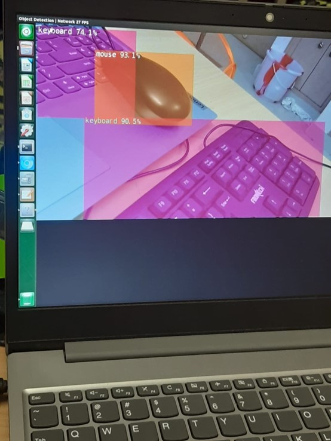
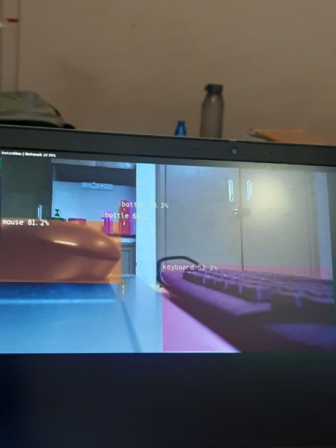
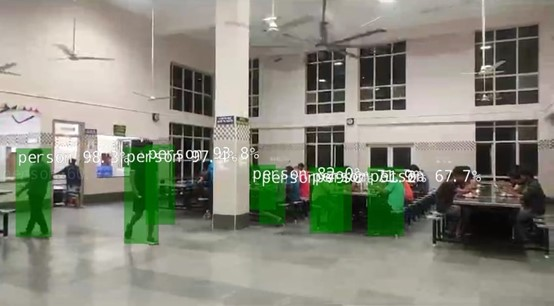
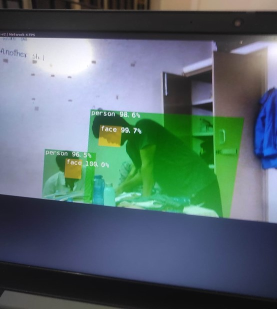

# Object Detection Using Jetson Nano NVIDIA
Internship work done for the IP1201 course of our 3rd Semester

### Team Members
- Aniket Choudhari (CS22B1010, GitHub:[Aniket-Choudhari-01](https://github.com/Aniket-Choudhari-01))
- Aditya Kumar Singh (CS22B1001, GitHub:[Adityacse1001](https://github.com/Adityacse1001/Adityacse1001))

## Overview
This project focuses on detecting objects using the Jetson Nano with the jetson-inference library, utilizing pre-trained models to detect objects in images, videos, and live camera feeds.

## Table of Contents

- [Setup Jetson Nano](#setup-jetson-nano)
- [Install jetson-inference](#install-jetson-inference)
- [Running Object Detection](#running-object-detection)
   - [On Static Images](#on-static-images)
   - [On Video Files](#on-video-files)
   - [On Multiple Images](#on-multiple-images)
   - [On Live Camera Stream](#on-live-camera-stream)
- [Customization](#customization)
   - [Changing Detection Models](#changing-detection-models)
   - [Adjusting Detection Sensitivity](#adjusting-detection-sensitivity)
   - [Customizing Overlay](#customizing-overlay)
- [Optimizing Performance](#optimizing-performance)
- [Results](#results)
- [References](#references)

## Setup Jetson Nano

Ensure your Jetson Nano is properly set up with the JetPack SDK, which includes TensorRT, CUDA, and cuDNN. Follow the [official guide](https://developer.nvidia.com/embedded/jetpack) to set up your Jetson Nano.

## Install jetson-inference

To install the `jetson-inference` library, execute the following commands:

```bash
# Clone the repository
git clone https://github.com/dusty-nv/jetson-inference.git

# Navigate to the project directory
cd jetson-inference

# Create a build directory
mkdir build
cd build

# Configure and build the project
cmake ..
make

# Install the library
sudo make install
sudo ldconfig
```
## Running Object Detection
### On Static Images:
```python
python3 detectnet.py --network=ssd-mobilenet-v2 images/peds_0.jpg images/test/output.jpg
```
### On Video Files
To detect objects in a video file:

```python
# Download a sample video
wget https://nvidia.box.com/shared/static/veuuimq6pwvd62p9fresqhrrmfqz0e2f.mp4 -O pedestrians.mp4

python3 detectnet.py pedestrians.mp4 images/test/pedestrians_ssd.mp4
```
### On Multiple Images
To process a sequence or directory of images:

```python
python3 detectnet.py "images/peds_*.jpg" images/test/peds_output_%i.jpg
```

### On Live Camera Stream
To perform real-time object detection using a camera connected to Jetson Nano:
```python
python3 detectnet.py /dev/video0 images/test/output.mp4
```
## Customization
### Changing Detection Models
You can change the detection model using the --network flag. For example, to use the ssd-inception-v2 model:
```python
python3 detectnet.py --network=ssd-inception-v2 input.jpg output.jpg
```
### Adjusting Detection Sensitivity
You can adjust the detection threshold to change the sensitivity:
```python
python3 detectnet.py --threshold=0.3 input.jpg output.jpg
```
The --threshold flag sets the minimum detection confidence (default is 0.5).
### Customizing Overlay
You can customize the overlay options to display bounding boxes, labels, and confidence scores:
```python
python3 detectnet.py --overlay=box,labels,conf input.jpg output.jpg
```
The overlay options include box, labels, conf, and none.
## Optimizing Performance
The first time you run a model, TensorRT will take a few minutes to optimize it for your device. After that, the model will load faster because the optimized version is saved on your device.
## Results
#### Object detection using webcam streaming:
<p float="left">
  
  
</p>

#### Detecting Students in the Mess:

#### Detecting Students in ths hostel using face and person recognition


## References

#### Jetson Inference
- [Jetson Inference GitHub Repository](https://github.com/dusty-nv/jetson-inference)
#### NVIDIA Jetson Nano Developer Kit
- [NVIDIA Jetson Nano Developer Kit](https://www.nvidia.com/en-us/autonomous-machines/embedded-systems/jetson-nano/)
#### JetPack SDK
- [JetPack SDK Documentation](https://developer.nvidia.com/embedded/jetpack)


